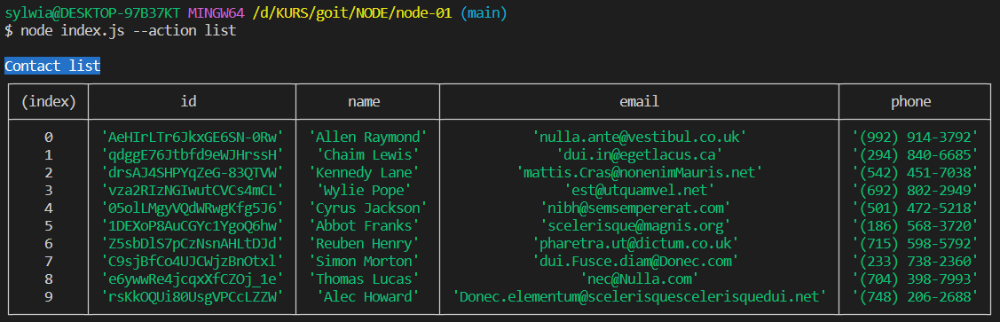
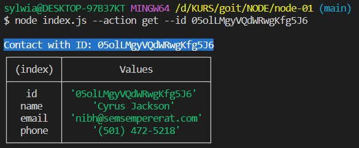
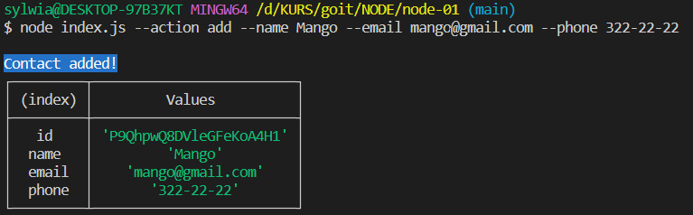
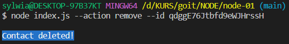

# ContactManager CLI

This command-line interface allows you to manage your contacts easily. You can perform various actions using the following commands:

`listContacts()`: Retrieves and displays the list of all contacts in a table format.
`getContactById(contactId)`: Fetches a contact by its unique ID.
`addContact(name, email, phone)`: Adds a new contact with the specified name, email, and phone number.
`removeContact(contactId)`: Removes a contact by its ID.

## Getting Started

1. Clone this repository.
2. Run `npm install` to install the necessary dependencies.

## Scripts

- `npm start`: Launches the application in production mode, allowing you to manage contacts using the command-line interface. To run it, enter the command `npm start`.
- `npm run start:dev`: Launches the application in development mode using the `nodemon` tool, which enables automatic reloading of the application when changes are made in the code. To run it, enter the command `npm run start:dev`.

## Usage

### List Contacts

To view the list of all your contacts in a table, use the following command:

```bash
node index.js --action list
```



### Get Contact by ID

To retrieve a specific contact by its ID, use the following command, replacing <contactId> with the actual ID:

```bash
node index.js --action get --id <contactId>
```



### Add a New Contact

To add a new contact, use the following command, replacing the placeholders with the actual contact information:

```bash
node index.js --action add --name <Name> --email <Email> --phone <Phone>
```



### Remove a Contact

To delete a contact, use the following command, replacing <contactId> with the actual ID of the contact you want to remove:

```bash
node index.js --action remove --id <contactId>
```


